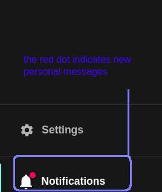

Documentation section of notifications plugin.

# Frontend
The frontend provides both UI and API.  
The frontend UI is implemented as a side bar item.  
The following screenshots shows how to use the notifications UI.  
Whenever a new system notification (update) is detected the frontend pops an alert to the user.  

## Installation and API
Refer to the plugin's [README](https://github.com/janus-idp/backstage-plugins/blob/main/plugins/notifications/README.md)

## The Frontend UI

### Notifications page

### New messages icon

### Filter and sort

### Updates

### Update alert
When a new update notification is received the UI pops an alert
  

### Notifications list

# Backend
The backend plugin provides the backend application for reading and writing notifications.  
It also provides and OpenAPI spec for generating clients in various languages.

## Installation
Refer to the plugin's [README](https://github.com/janus-idp/backstage-plugins/blob/main/plugins/notifications-backend/README.md)

## OpenAPI
OpenAPI spec is located [here](https://github.com/janus-idp/backstage-plugins/blob/main/plugins/notifications-backend/src/openapi.yaml)

## REST endpoints
The readme file provides examples for retrieving and posting notifications via REST requests.