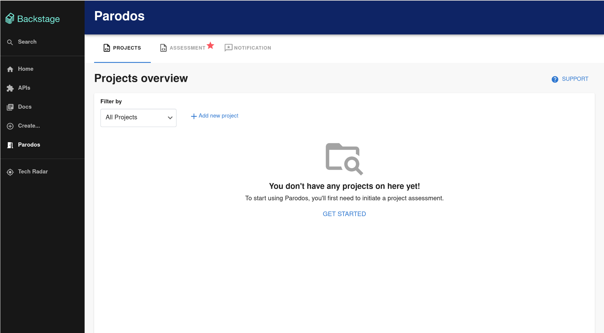
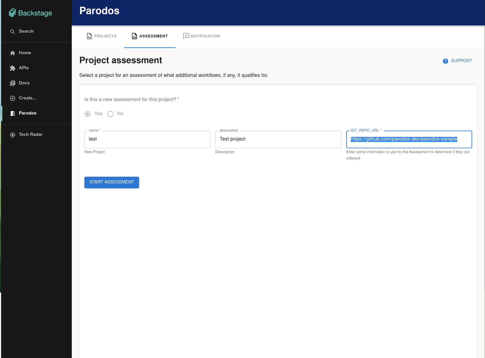
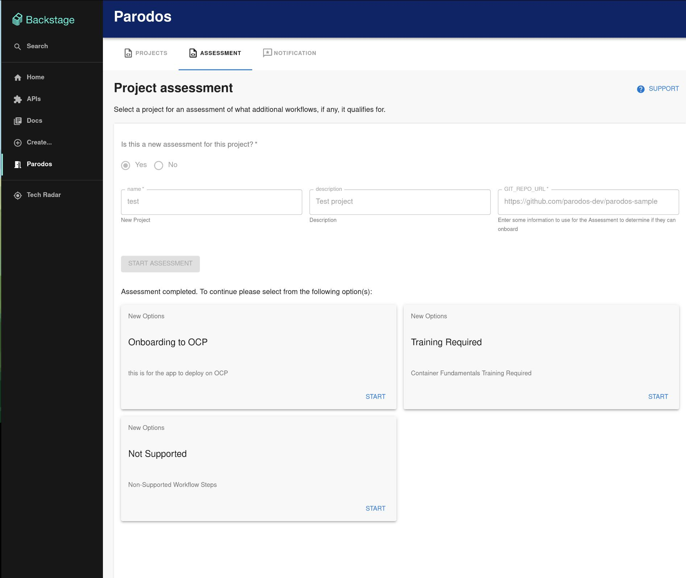

Once Parodos and Backstage is already installed, user can start running
workflows. As soon you have access to Backstage, in the leff hand you can see
the Parodos entry.

Once in there, a new workflow can be executed, but first, you need to create a
project.

{: width="100%" }

As soon as the project is created, you need to execute a new assesment, where
the workflow admin defined the inputs:

{: width="100%" }

This example assesment definitinon can be retrieved using the API with the
following command:

```bash
curl "http://localhost:7007/api/proxy/parodos/workflowdefinitions?name=onboardingAssessment_ASSESSMENT_WORKFLOW" | jq .
```

And the output for the given assesment will be like this:

```json
[ {
  "id" : "2041b61e-1307-41b7-aa95-06ab50b2f8b7",
  "name" : "onboardingAssessment_ASSESSMENT_WORKFLOW",
  "type" : "ASSESSMENT",
  "processingType" : "SEQUENTIAL",
  "author" : null,
  "createDate" : "2023-04-28T10:22:34.680+00:00",
  "modifyDate" : "2023-04-28T10:22:34.680+00:00",
  "properties" : {
    "version" : null
  },
  "works" : [ {
    "id" : "aa660b4f-eaea-4652-9958-0b59f3ba5a04",
    "name" : "onboardingAssessmentTask",
    "workType" : "TASK",
    "parameters" : {
      "GIT_REPO_URL" : {
        "format" : "text",
        "description" : "Enter some information to use for the Assessment to determine if they can onboard",
        "type" : "string",
        "required" : true
      }
    }
  } ]
} ]
```

The execution of that assesment give to the user a few more workflow, that can
be trigger based on the parent assesment:

This is the example in the UI:

{: width="100%" }

And here is the output as API call:

```json
{
  "workFlowExecutionId" : "4a0797ea-a368-47da-94f7-e4c1f772d4f3",
  "workFlowOptions" : {
    "currentVersion" : null,
    "upgradeOptions" : [ ],
    "migrationOptions" : [ ],
    "newOptions" : [ {
      "identifier" : "ocpOnboarding",
      "displayName" : "Onboarding to OCP",
      "description" : "this is for the app to deploy on OCP",
      "details" : [ "this is for the app to deploy on OCP" ],
      "workFlowName" : "ocpOnboardingWorkFlow"
    }, {
      "identifier" : "badRepoOption",
      "displayName" : "Training Required",
      "description" : "Container Fundamentals Training Required",
      "details" : [ "Container Fundamentals Training Required" ],
      "workFlowName" : "simpleSequentialWorkFlow_INFRASTRUCTURE_WORKFLOW"
    }, {
      "identifier" : "notSupportOption",
      "displayName" : "Not Supported",
      "description" : "Non-Supported Workflow Steps",
      "details" : [ "Non-Supported Workflow Steps" ],
      "workFlowName" : "simpleSequentialWorkFlow_INFRASTRUCTURE_WORKFLOW"
    } ],
    "continuationOptions" : [ ],
    "otherOptions" : [ ],
    "optionsAvailable" : false
  },
  "workStatus" : "COMPLETED"
}
```

So, a few workflows can be executed, and checked via API, as example:

```bash
curl "http://localhost:7007/api/proxy/parodos/workflowdefinitions?name=ocpOnboardingWorkFlow" | jq .
curl "http://localhost:7007/api/proxy/parodos/workflowdefinitions?name=simpleSequentialWorkFlow_INFRASTRUCTURE_WORKFLOW" | jq .
curl "http://localhost:7007/api/proxy/parodos/workflowdefinitions?name=simpleSequentialWorkFlow_INFRASTRUCTURE_WORKFLOW" | jq .
```

This will help users to run the workflows that needs to be approved to approve
the assesment.

With this, the execution of the workflow is already explained, the next steps are:

- Writting a custom workflow
- [Understanding Workflows Definitions](../operations/workflows.md)
